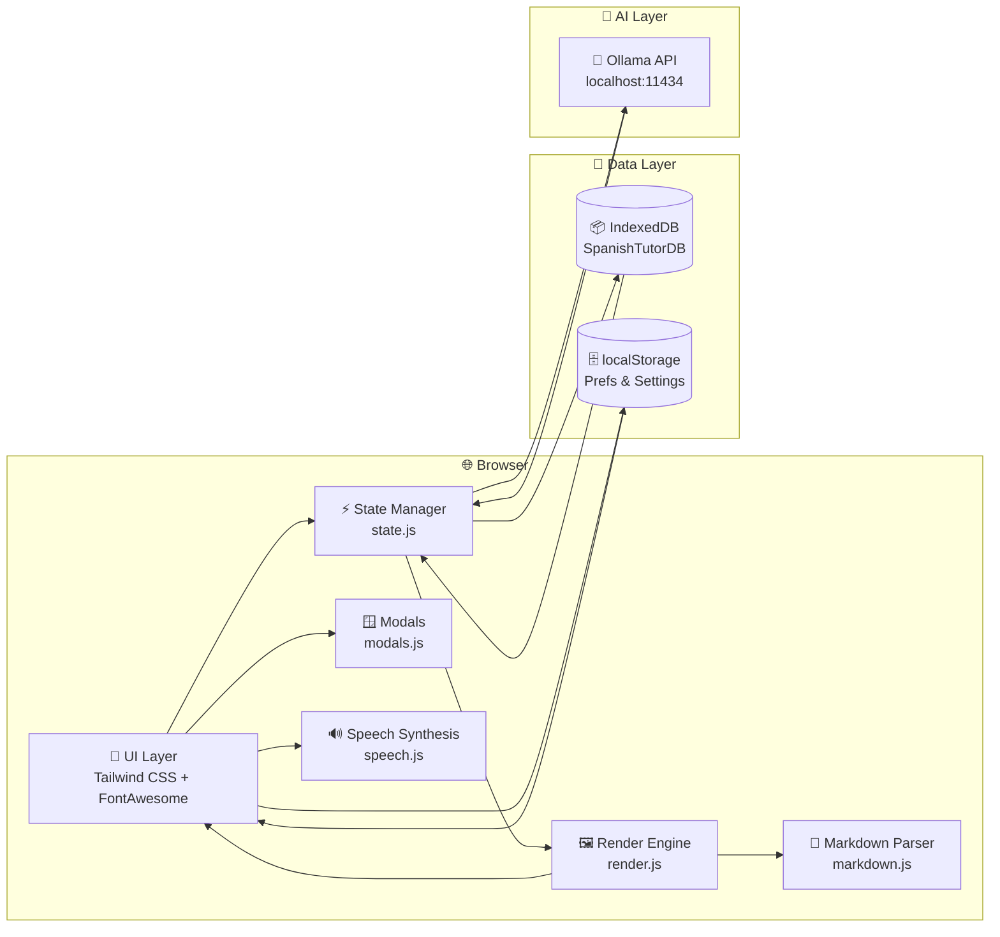
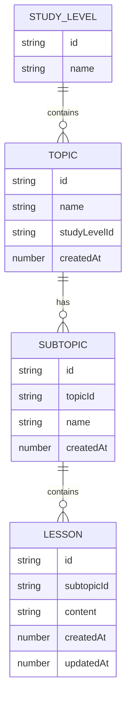
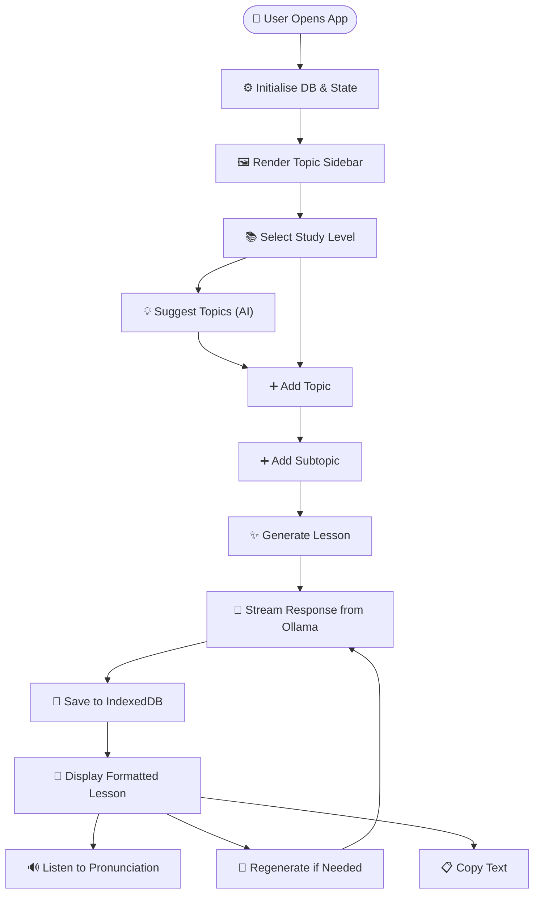
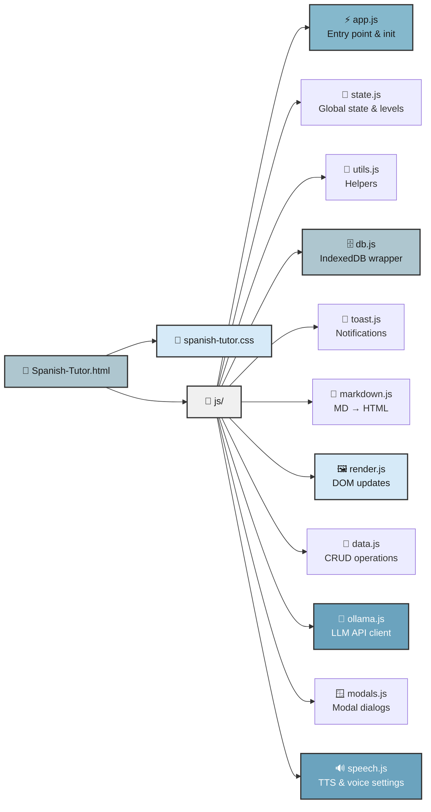

# 🇪🇸 Spanish Tutor — Ollama

A beautiful, single-page web application for learning Spanish, powered by your local **Ollama** instance. Generate structured lessons with AI, listen to native pronunciation, and organize your study material — all stored locally in your browser.


---

## ✨ Features

| Feature | Description |
|---------|-------------|
| 🤖 **AI Lesson Generation** | Creates structured lessons via local Ollama LLMs (streaming response support) |
| 💡 **AI Topic Suggestions** | Ask Ollama for topic ideas tailored to your current study level — pick and add the ones you like |
| 🗂️ **Topic Hierarchy** | Organise content as Topics → Subtopics → Lessons |
| 🎯 **6 Study Levels** | Lower Beginner → Upper Beginner → Lower Intermediate → Upper Intermediate → Lower Advanced → Upper Advanced |
| 🔊 **Native Speech** | Right-click any Spanish text to hear it spoken in a native accent |
| 📝 **Markdown Rendering** | Rich, beautifully formatted lessons with headers, lists, bold text and more |
| 💾 **Local-First Storage** | Everything lives in your browser via IndexedDB — no cloud required |
| 🎨 **Pastel UI** | Clean, modern interface built with Tailwind CSS and custom animations |
| 🔍 **Search & Filter** | Quickly find topics within your current study level |
| ⚙️ **Model Selector** | Choose any installed Ollama model, or enter a custom model tag |
| 🗑️ **Safe Deletion** | Confirm before deleting topics, subtopics or lessons |

---

## 🏗️ Architecture



---

## 📊 Data Model



---

## 🎯 User Flow



---

## 📁 Project Structure



---

## 🚀 Quick Start

1. **Install & run Ollama**
   ```bash
   # macOS / Linux
   curl -fsSL https://ollama.com/install.sh | sh
   ollama serve
   # In another terminal:
   ollama pull llama3.2
   ```

2. **Open the app**
   Simply open `Spanish-Tutor.html` in any modern browser (Chrome, Edge, Firefox).
   > No build step required — it's pure HTML + JS + CSS!

3. **Start learning!**
   - Select your study level from the dropdown
   - Add topics manually, or click **Suggest Topics** in the Add Topic modal to get AI-generated ideas
   - Add subtopics in the sidebar
   - Click **Generate Lesson** and watch Ollama craft your personalised Spanish content

---

## 🛠️ Tech Stack

| Technology | Role |
|------------|------|
| **Vanilla JavaScript** | No frameworks — lightweight and fast |
| **Tailwind CSS** (CDN) | Utility-first styling with custom pastel theme |
| **FontAwesome** (CDN) | Beautiful icons throughout the UI |
| **IndexedDB** | Offline-capable, structured local storage |
| **Web Speech API** | Native Spanish text-to-speech |
| **Ollama API** | Local LLM inference for lesson generation |

---

## 📝 Lesson Format

Each generated lesson includes the following sections:

1. **Introduction** — Overview of what the lesson covers
2. **Key Vocabulary** — 8–12 essential Spanish words/phrases
3. **Grammar & Rules** — Clear explanations with bold Spanish examples
4. **Example Sentences** — 6–8 practical sentences with translations
5. **Practice Exercises** — 5 fill-in-the-blank or translation tasks
6. **Mini Quiz** — 4 multiple-choice questions with answers
7. **Cultural Note** — An interesting cultural fact

---

## 🎨 Customisation

### Study Levels
The 6 built-in proficiency levels are defined in `js/state.js`:

```javascript
const STUDY_LEVELS = [
    { id: 'lb', name: 'Lower Beginner' },
    { id: 'ub', name: 'Upper Beginner' },
    { id: 'li', name: 'Lower Intermediate' },
    { id: 'ui', name: 'Upper Intermediate' },
    { id: 'la', name: 'Lower Advanced' },
    { id: 'ua', name: 'Upper Advanced' }
];
```

### Theme Colours
Pastel palette defined in `Spanish-Tutor.html` via Tailwind config:

| Token | Hex | Usage |
|-------|-----|-------|
| `pastel-blue` | `#AEC6CF` | Primary accent, header, active states |
| `soft-blue` | `#D6EAF8` | Backgrounds, empty states |
| `hover-blue` | `#85B8CC` | Button hover states |
| `deep-blue` | `#6BA3BE` | Icons, emphasis |
| `card-bg` | `#F8FBFD` | Card/sidebar backgrounds |

---

## 🔊 Audio Features

- **Right-click** any Spanish text inside a lesson to see a context menu with:
  - 🎵 **Play in native voice**
  - ⏹️ **Stop audio**
  - 📋 **Copy to clipboard**
- **Text selection** reveals a floating "Play" button
- **Voice settings** (gear icon in header) let you choose your preferred Spanish voice
- Automatically detects and prioritises local Spanish voices

---

## 📸 Screenshots

> *(Recommended: Add screenshots of the main UI, a generated lesson, and the voice settings modal)*

---

## 🤝 Contributing

Contributions welcome! The codebase is intentionally simple and modular — each `js/*.js` file has a single responsibility.

1. Fork the repo
2. Create a feature branch: `git checkout -b feature/amazing-thing`
3. Commit your changes: `git commit -am 'Add amazing thing'`
4. Push to the branch: `git push origin feature/amazing-thing`
5. Open a Pull Request

---

## 📜 License

MIT License — feel free to use, modify, and share!

---

<p align="center">
  <em>¡Buena suerte con tu español! 🎉</em>
</p>
